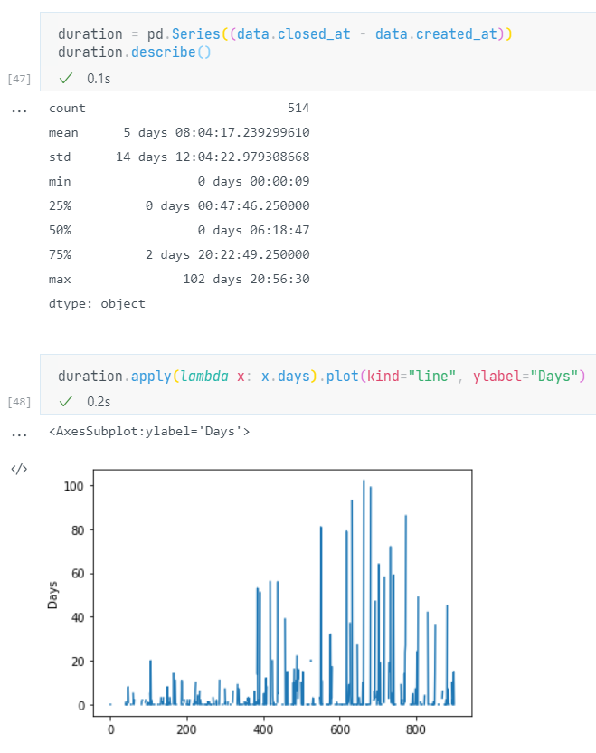

# Got Issues

I've got ninety-nine issues but fetching data from my repository ain't one.



A standard-library Python utility that uses the GitHub API to collect data from any repository. Uses [list repository issues (docs)](https://docs.github.com/en/rest/reference/issues#list-repository-issues) which includes both Issues and Pull Requests.

Pass the `owner/repository-name` and some number of months (e.g. `24`) to output issues data for that time period. You can then do fun stuff like plot the data in a [Jupyter Notebook](https://jupyter.org/) and answer questions such as:

- How long do issues remain open before being resolved?
- How many issues were labelled "hotfix" in the last year?
- Who are the most active repository contributors over the last month?
- What percentage of issues include the word "please"?

## Usage

```sh
$ python fetch.py -h
usage: fetch.py [-h] [--token TOKEN] repository months
```

Fetch data for issues from a GitHub repository for a number of past months.

- `repository`: The GitHub repository to fetch issues from in the form `owner/repository-name`
- `months`: Number of past months to fetch issues for, e.g. `24` for the last two years.
- Optional `--token`, `-t`: [Personal Access Toke](https://docs.github.com/en/github/authenticating-to-github/keeping-your-account-and-data-secure/creating-a-personal-access-token)n string for private repositories.

Data will be JSON to stdout, so you may like to redirect this to a file:

```sh
python fetch.py OWASP/wstg 24 > data.json
```

Run `make help` to see some convenience commands provided by the self-documenting Makefile.

If you need to run this task repeatedly, you can use environment variables and run the much shorter command `make fetch`. For example, in `.env`:

```sh
export REPO=github_user_or_organization/name_of_repository
export MONTHS=2
export TOKEN=supersecretGitHubPAT # For private repositories
```

Then get your data:

```sh
make fetch > data.json
```

## Pandas Example

You can replicate the screenshot by creating a [Jupyter Notebook](https://jupyter.org/) with the following code blocks:

```py
import pandas as pd

data = pd.read_json("data.json")
duration = pd.Series(data.closed_at - data.created_at)
duration.describe()
```

```py
duration.apply(lambda x: x.days).plot(kind="line", ylabel="Days")
```
